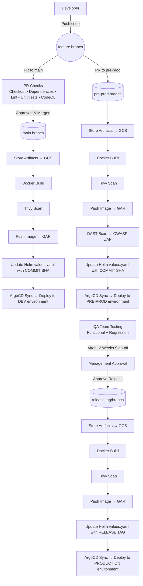

## CI/CD Pipeline Architecture (Dev → Pre-Prod → Prod)

# CI/CD Pipeline Architecture — Dev → Pre‑Prod → Prod (GitOps with ArgoCD)

This diagram shows a **GitHub‑first CI/CD** with **GAR** (images), **GCS** (artifacts), **Trivy** (image scan),
**CodeQL** (SAST), **OWASP ZAP** (DAST), **Helm** (values.yaml), and **ArgoCD** for **GitOps** sync into clusters.

## High‑Level Flow
1) **Developer** pushes code to a feature branch and opens a **PR to `main`**.  
   PR checks run: **checkout → dependencies → lint → unit tests → CodeQL**.  
   If everything passes and reviewers approve → **merge to `main`**.

2) **Development Pipeline** (on merge to `main`):
   - Store build **artifacts to GCS**  
   - **Docker build** → **Trivy scan**  
   - **Push image to GAR**  
   - **Update Helm `values.yaml` with COMMIT_SHA** (immutable deploy)  
   - Create PR to **ArgoCD manifests repo** → **ArgoCD sync** to **Dev cluster**

3) **Pre‑Prod**:
   - Raise **PR to pre‑prod branch** → merge triggers pre‑prod pipeline  
   - Store artifacts to GCS, Docker build, Trivy scan, **push to GAR**  
   - **DAST (OWASP ZAP)** against pre‑prod endpoint  
   - Update Helm values with **COMMIT_SHA**, PR to manifests → **ArgoCD sync** to **Pre‑Prod**  
   - **QA tests** run on the application

4) **After ~2 weeks** and **management approval**, raise **PR for production release**.

5) **Production Pipeline** (on release tag/branch):
   - Store artifacts to GCS, Docker build, Trivy scan, **push to GAR**  
   - Update Helm values with **RELEASE TAG** (traceable)  
   - **Create release branch/tag**  
   - PR to manifests → **ArgoCD sync** to **Prod**

## Notes & Tips
- Prefer **immutable image tags** (commit SHA) for Dev/Pre‑Prod and **annotated release tags** for Prod.
- Security gates: **CodeQL** (SAST) early, **Trivy** on images, **ZAP (DAST)** in Pre‑Prod.
- Everything deploys by **GitOps**: app version is driven by **Helm chart changes** that ArgoCD watches.
- Store test reports and build logs in **GCS**; images in **GAR**.
